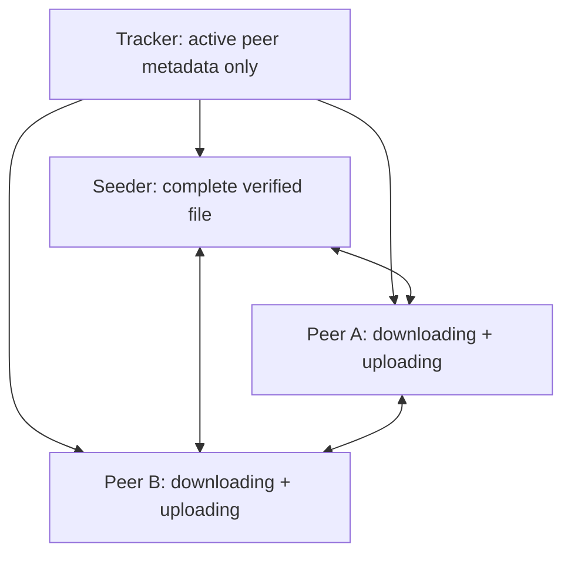

# SwarmSync

SwarmSync is a production-minded C++20, BitTorrent-style file distribution system for trusted local and LAN environments. It splits a file into SHA-256-verified chunks so peers can download different chunks concurrently and immediately share the chunks they have already verified.

SwarmSync is a BitTorrent-style peer-to-peer file-sharing system. Its main purpose is to share large files faster and more reliably without putting all load on one central server.


The tracker is **not** a file server. It stores only short-lived peer presence metadata; file bytes flow directly between peers.

## Why it exists

When many users download one large file from a conventional server, that server becomes the bandwidth bottleneck and a single point of failure. SwarmSync distributes the load across peers:

- A seed peer begins with the complete file.
- The file is split into small chunks with immutable SHA-256 hashes.
- Downloaders request different chunks concurrently from available peers.
- A downloader advertises each verified chunk and can upload it before its own download finishes.
- Resume state records only durably written chunks, and restart revalidates them before requesting anything missing or corrupt.



## What is implemented

- C++20, POSIX TCP networking, RAII socket ownership, timeouts, bounded protocol headers, and macOS-safe broken-pipe handling.
- Metadata-only tracker with shared-token authorization, peer expiry, observed source IP addresses, bounded worker handling, and configurable connection/metadata/response limits.
- Immutable manifest format with file hash, per-chunk SHA-256 hashes, safe filename validation, and swarm ID.
- Concurrent downloader workers with peer discovery, failover retries, byte-count validation, and per-chunk integrity checks.
- Peer server with bounded connection queue and a maximum-connections limit.
- Resume state published only after each verified chunk is durably synced; completed chunks are re-hashed before a restart trusts them.
- Whole-file SHA-256 verification before `.part` is renamed to the final file.
- Unit tests, loopback integration test, CLI smoke test, and a two-downloader local demo.

## Important security boundary

SwarmSync V1 is suitable for a **trusted local network or private VPN**. Its shared token controls membership but does not encrypt traffic.

It is not yet safe to expose on the public Internet. A production public-network deployment needs TLS/mTLS, per-peer identity, secret rotation, rate limits, audit logging, authenticated manifest distribution, firewall policy, and threat modeling for NAT/relay behavior. See the [operations runbook](docs/runbook.md).

## Prerequisites

- A C++20 compiler (`g++` 13+ or equivalent)
- GNU Make
- OpenSSL development headers and crypto library
- CMake 3.20+ is optional; the included Makefile works without CMake

On Ubuntu/Debian:

```bash
sudo apt update
sudo apt install build-essential libssl-dev cmake
```

## Build and verify

```bash
git clone <your-repository-url>
cd SwarmSync
make all
make test
```

The project uses strict warnings:

```text
-std=c++20 -Wall -Wextra -Wpedantic -Werror
```

To use CMake instead:

```bash
cmake -S . -B build-cmake
cmake --build build-cmake
ctest --test-dir build-cmake --output-on-failure
```

## One-command local demonstration

The demo builds the binaries, creates a deterministic ~1.1 MiB source file, starts one tracker and one seeder, runs two concurrent download peers, and compares all three SHA-256 hashes. By default it asks the operating system for free local ports and waits for active service readiness.

```bash
export SWARMSYNC_TOKEN='your-private-demo-token'
bash scripts/local_demo.sh
```

The script prints the retained output directory. You can override the automatically selected ports when you need fixed values:

```bash
TRACKER_PORT=48000 SEED_PORT=48001 DOWNLOAD_A_PORT=48002 DOWNLOAD_B_PORT=48003 \
SWARMSYNC_TOKEN='your-private-demo-token' bash scripts/local_demo.sh
```

## Manual workflow

Create a private token first. Every process below must use the same token.

```bash
export SWARMSYNC_TOKEN='replace-with-a-long-random-private-token'
```

### 1. Create an immutable manifest

```bash
./build/swarmsync manifest create \
  --file ./releases/product-installer.bin \
  --out ./releases/product-installer.swarmsync \
  --chunk-size 262144
```

Keep the manifest with the release metadata. The manifest swarm ID identifies one exact file version.

### 2. Start the tracker

```bash
./build/swarmsync-tracker \
  --port 47000 \
  --bind 127.0.0.1 \
  --ttl-seconds 30 \
  --max-connections 32 \
  --workers 4 \
  --max-swarms 1024 \
  --max-peers-per-swarm 256 \
  --max-response-peers 128
```

For LAN use, bind to a private interface such as `0.0.0.0` only after configuring firewall rules.

### 3. Start a seeder

```bash
./build/swarmsync seed \
  --manifest ./releases/product-installer.swarmsync \
  --file ./releases/product-installer.bin \
  --tracker-host 127.0.0.1 \
  --tracker-port 47000 \
  --listen-port 47001 \
  --peer-id seed-a
```

The seeder checks that its file size and whole-file SHA-256 match the manifest before advertising it.

### 4. Start a downloader

```bash
./build/swarmsync download \
  --manifest ./releases/product-installer.swarmsync \
  --out-dir ./downloads/peer-a \
  --tracker-host 127.0.0.1 \
  --tracker-port 47000 \
  --listen-port 47002 \
  --peer-id peer-a \
  --workers 4 \
  --retries 3
```

Start another downloader with a different `--listen-port`, `--peer-id`, and output directory. Each downloader becomes an upload source as its chunks finish verifying.

## Commands

| Command | Purpose |
| --- | --- |
| `swarmsync manifest create` | Hashes a file, splits it into chunks, and writes the immutable manifest. |
| `swarmsync seed` | Validates a complete file, serves its chunks, and refreshes tracker presence. |
| `swarmsync download` | Downloads verified chunks concurrently, persists resume state, serves acquired chunks, and publishes only a fully verified file. |
| `swarmsync-tracker` | Maintains active peer discovery records; it never receives file bytes. |

Run `./build/swarmsync --help` or `./build/swarmsync-tracker --help` for exact options.

## Resume behavior

For a download named `product-installer.bin`, SwarmSync uses:

```text
downloads/peer-a/product-installer.bin.part
downloads/peer-a/<swarm-id>.resume
downloads/peer-a/product-installer.bin
```

The `.part` file stays private until all chunks and the final full-file hash verify. If a downloader stops, re-run the same command with the same manifest and output directory. SwarmSync re-hashes every resume-marked chunk before trusting it, clears any invalid marks, and requests only missing or invalid chunks.

## Wire protocol

Control headers are bounded, printable ASCII lines. The tracker accepts:

```text
ANNOUNCE <token> <swarm-id> <peer-id> <listen-port> <all|none|sorted-chunk-list>
PEERS <token> <swarm-id>
```

A peer serves chunks with:

```text
GET <token> <swarm-id> <chunk-index>
DATA <byte-count> <sha256>
<raw chunk bytes>
```

The downloader checks the response byte count and response digest against the manifest before writing anything to its partial file.

## Project structure

```text
apps/       command-line applications
include/    module interfaces
src/        tracker, peer server, downloader, protocol, integrity, persistence
tests/      unit, CLI, demo, and integration coverage
scripts/    repeatable local demonstration
config/     safe environment example
docs/       operations runbook and engineering design
```

## Tests

`make test` runs:

- Manifest and SHA-256 integrity tests
- Strict protocol parsing and malformed-input tests
- Tracker authorization and stale-peer expiry tests
- Tracker slow-client, capacity-limit, and listener-shutdown tests
- Resume-state persistence/mismatch and corrupt-partial recovery tests
- Loopback tracker → seeder → downloader integration test
- CLI error/help smoke test and dynamic-port demo test

The demo test additionally proves two independent download peers produce byte-identical files.

## Design documents

- [V1 architecture and security scope](docs/superpowers/specs/2026-09-08-swarmsync-design.md)
- [Implementation plan](docs/superpowers/plans/2026-09-08-swarmsync-v1.md)
- [Operations runbook](docs/runbook.md)

## Interview explanation

> “SwarmSync is a C++ peer-to-peer file distribution system inspired by BitTorrent. I designed it to avoid a single-server bandwidth bottleneck by splitting files into SHA-256-verified chunks and allowing each downloader to become an uploader. I implemented a bounded metadata-only tracker, concurrent chunk workers, retry/failover logic, restart-safe resume validation, final file verification, and a reproducible multi-peer demo.”

